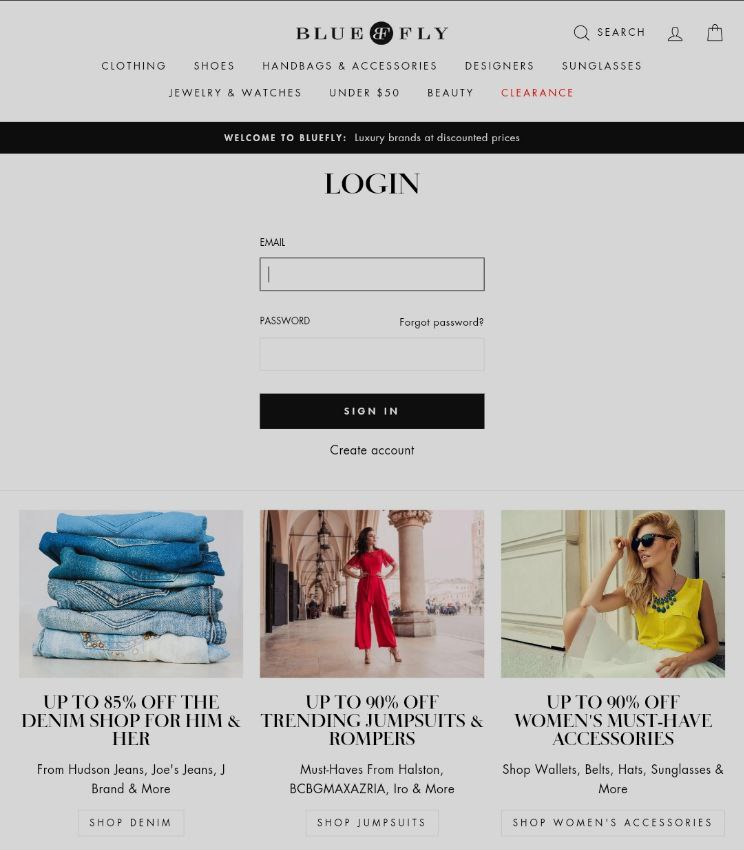
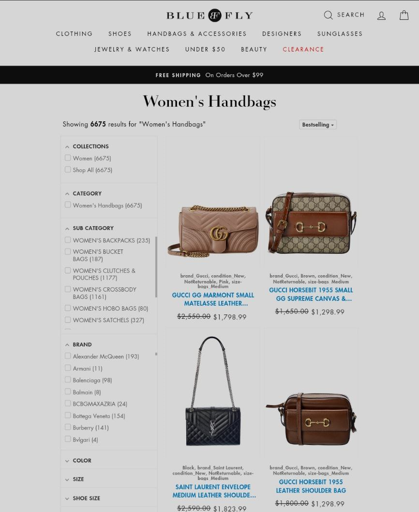

# BlueFly
Clone of Bluefly is the online shopping destination for the style obsessed, shop designer styles from Prada, Gucci, Dior, Valentino .

Features:
Local Sign-in/Sign-up.
Responsive Design.
Functional User Interface.
Registration
Login
Searching items
Different pages based on different category
See more details about item
add items to the cart
remove items from the cart
Checkout

Tech Stack: HTML | CSS | Javascript | Bootstrap | React | MongoDB | Express | Nodejs 

Areas Of Responsibility:
Created a functional website, where user can create account and login.
Worked closely with the team to optimize and implement the
frontend.
Set deadlines and project milestones for the team.
Authenticated payment system.
Developed a responsive website for all screen sizes.
Different pages based on different category
See more details about item
 mplemented review product and buying functionalities with online payment options.

A collaborative project built by a team of 5 executed in 7 days..

LIVE DEMO:  https://famous-caramel-42646b.netlify.app/

## Some of the screenshots are below:-

